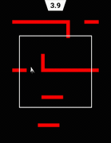

# Open Source AI/ML Projects
<a href="https://github.com/rameshvarun/NeuralKart"></img></a>
<a href="https://github.com/harrison8989/recolorizer"></img></a>
<a href="https://github.com/rameshvarun/showdownbot"></img></a>

# Open Source Games
<a href="https://github.com/rameshvarun/BlueScreen"></img></a>
<a href="https://github.com/rameshvarun/fault"></img></a>
<a href="https://github.com/rameshvarun/Ulfhednar"></img></a>
<a href="https://github.com/rameshvarun/dunces-on-deck"></img></a>
<a href="https://github.com/KremerTom/Runner-Game"></img></a>
<a href="https://github.com/rameshvarun/CardinalGameJam"></img></a>
<a href="https://github.com/rameshvarun/Invoke"></img></a>
